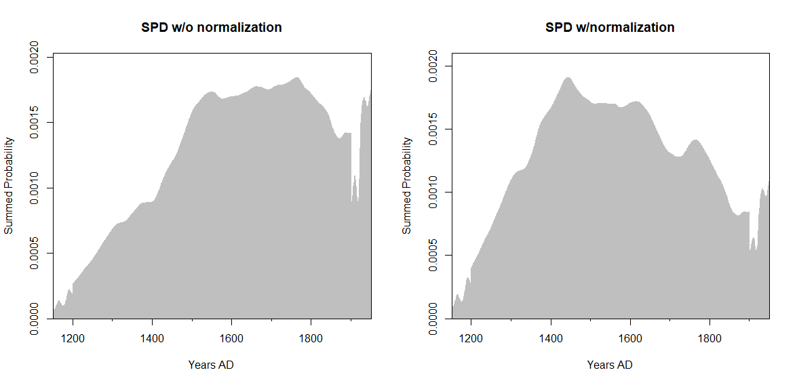
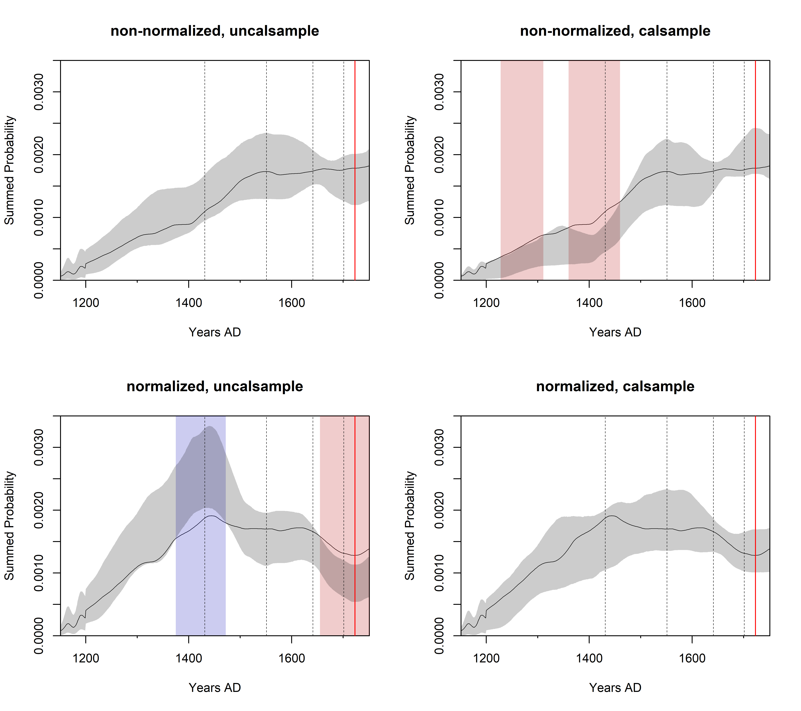
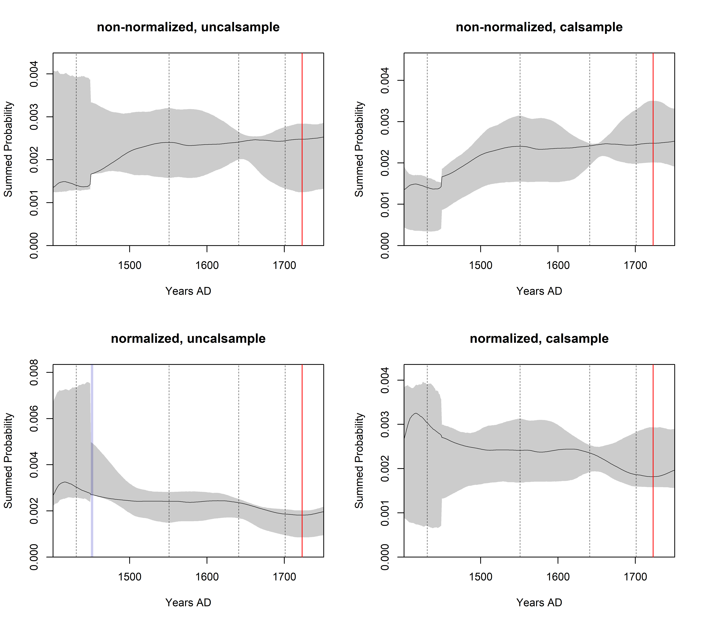
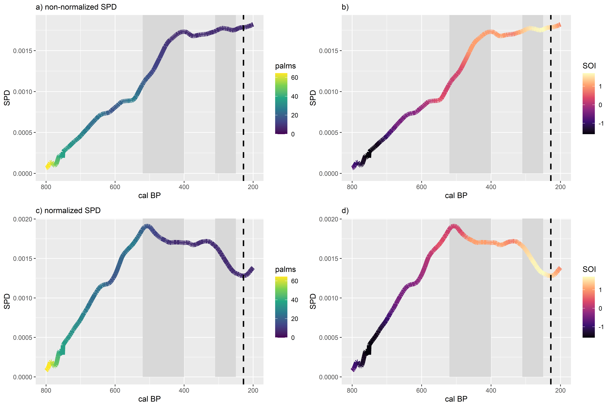
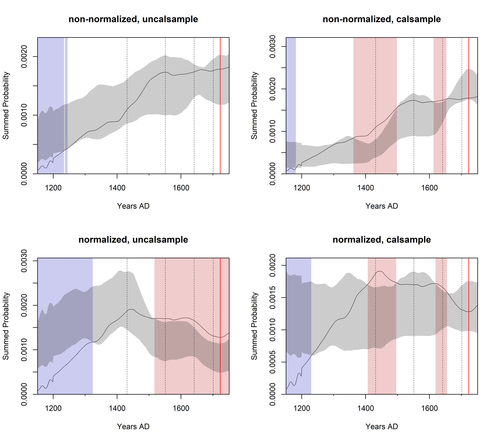

# RN_demography
Demographic analyses for Rapa Nui

## Notes on data files
rapanui_DiNapoli_etal.csv is the radiocarbon data with corrected site codes and classification of dates by archaeological context

RN_demography.R is working R script for demographic analyses

RAPANUINW.csv is supplementary data from Lima et al. used to fit their nls models, incluiding time series data on palm cover and SOI index

rapnveget.csv is supplementary data from Lima et al. used to fit their linear regression models

## Preliminary results

The plot below shows the SPD for settlement sites with and without normalization.

Results of general logistic growth model fitted to spd of settlement sites using different combinations of c14 normalization and back-calibration methods. Gray vertical lines are Lima et al.'s proposed collapse events. Red line is European contact in 1722 AD.

Results of uniform null models testing the hypothesis that there was any population change from 1400 - 1750 AD.

Plot of relationship between the SPD and palm cover and SOI index with normalized and non-normalized dates. Gray vertical bars are Lima et al.'s proposed collapses. Black dashed line is European contact in AD 1722.

Results of linear models.

